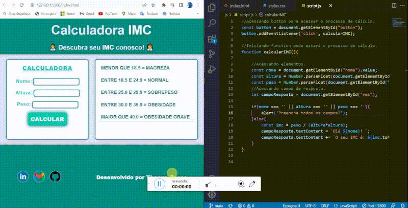

# IMC

## Acesse o Projeto
- 🔗[Acesse Aqui o Projeto!](https://thasyo.github.io/imc/)

Preview do Projeto

# 📃 Descrição 📃

- Objetivo

    
- O objetivo desse projeto é auxiliar o usuário a descobrir o seu IMC.

- Propósito

    
- O propósito deste projeto foi desenvolver meus estudos, praticando e concretizando conhecimentos em JavaScript.

# 🛠️ Tecnologias 🛠️

- HTML
- CSS
- GIT
- GITHUB
- JAVASCRIPT
- VSCODE
- FIGMA

# 👨‍💻 Status do Projeto 👨‍💻

- Finalizado com sucesso! ✔️

# 🛑 Não pare por aqui! 🛑

 
Gostou do meu projeto? Então me acompanhe no LinkedIn, para ficar por dentro das minhas últimas aplicações! 😉

 - 🔗[Linkedin](https://www.linkedin.com/in/thasyo-peres-63aa27235/)